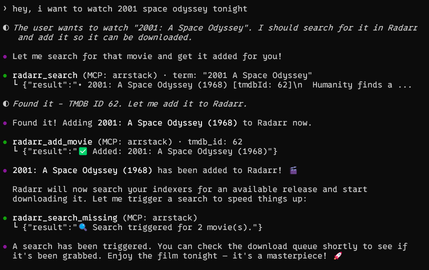

# 🎬 arrstack-mcp

An [MCP](https://modelcontextprotocol.io/) server that gives AI assistants control over your **Sonarr**, **Radarr**, **Prowlarr**, **qBittorrent**, **Jellyfin**, **RomM**, and **GameVault** homelab media and game libraries.

Works with **Claude Desktop**, **Cursor**, **VS Code Copilot**, **OpenClaw**, and any other MCP-compatible client.

## Demo



## Features

| Service | Tools |
|---------|-------|
| **Sonarr** | List series, search & add shows, upcoming episodes, download queue |
| **Radarr** | List movies, search & add movies, download queue |
| **Prowlarr** | List/test indexers, search releases, health check |
| **qBittorrent** | List/pause/resume/delete torrents, add magnets, transfer stats |
| **Jellyfin** | List libraries, recent additions, system info |
| **RomM** | System info, list platforms, list/search ROMs, game details |
| **GameVault** | List/search PC games, game details, random game, reindex library |

Only configure the services you use — unconfigured services are gracefully skipped.

## Quick Start

### Option 1: Claude Desktop / Cursor / VS Code (stdio)

1. Install dependencies:

   ```bash
   pip install "mcp[cli]>=1.9.0" httpx
   ```

2. Add to your MCP client config (e.g. `claude_desktop_config.json`):

   ```json
   {
     "mcpServers": {
       "arrstack": {
         "command": "python",
         "args": ["/path/to/arrstack-mcp/server.py"],
         "env": {
           "SONARR_URL": "http://localhost:8989",
           "SONARR_API_KEY": "your-api-key",
           "RADARR_URL": "http://localhost:7878",
           "RADARR_API_KEY": "your-api-key",
           "QBT_URL": "http://localhost:8080",
           "QBT_USER": "admin",
           "QBT_PASS": "your-password",
           "JELLYFIN_URL": "http://localhost:8096"
         }
       }
     }
   }
   ```

3. Restart your MCP client. Done!

### Option 2: Docker (HTTP transport)

For remote setups or when running alongside your *arr stack:

```bash
git clone https://github.com/ct4nk3r/arrstack-mcp.git
cd arrstack-mcp
cp .env.example .env
# Edit .env with your service URLs and API keys
docker compose up -d
```

The server runs on port `8000` with Streamable HTTP transport.

#### Connect to OpenClaw

```bash
openclaw mcp set arrstack '{"url":"http://arrstack-mcp:8000/mcp","transport":"streamable-http"}'
```

#### Connect to other HTTP MCP clients

Point your client to `http://<host>:8000/mcp` using Streamable HTTP transport.

### Option 3: Docker on the same network as your *arr stack

If your media services run in Docker, add `arrstack-mcp` to the same network:

```yaml
services:
  arrstack-mcp:
    build: .
    container_name: arrstack-mcp
    ports:
      - "8000:8000"
    environment:
      - SONARR_URL=http://sonarr:8989
      - SONARR_API_KEY=your-key
      - RADARR_URL=http://radarr:7878
      - RADARR_API_KEY=your-key
      - QBT_URL=http://qbittorrent:8080
      - QBT_USER=admin
      - QBT_PASS=your-password
      - JELLYFIN_URL=http://jellyfin:8096
    networks:
      - your-media-network
```

## Configuration

All configuration is done via environment variables:

| Variable | Required | Description |
|----------|----------|-------------|
| `SONARR_URL` | No | Sonarr base URL (e.g. `http://localhost:8989`) |
| `SONARR_API_KEY` | If Sonarr | Sonarr API key (Settings → General) |
| `RADARR_URL` | No | Radarr base URL (e.g. `http://localhost:7878`) |
| `RADARR_API_KEY` | If Radarr | Radarr API key (Settings → General) |
| `QBT_URL` | No | qBittorrent Web UI URL (e.g. `http://localhost:8080`) |
| `QBT_USER` | If qBt | qBittorrent username (default: `admin`) |
| `QBT_PASS` | If qBt | qBittorrent password |
| `JELLYFIN_URL` | No | Jellyfin base URL (e.g. `http://localhost:8096`) |
| `JELLYFIN_API_KEY` | No | Jellyfin API key (optional, for authenticated endpoints) |
| `PROWLARR_URL` | No | Prowlarr base URL (e.g. `http://localhost:9696`) |
| `PROWLARR_API_KEY` | If Prowlarr | Prowlarr API key (Settings → General) |
| `ROMM_URL` | No | RomM base URL (e.g. `http://localhost:8081`) |
| `ROMM_API_TOKEN` | If RomM | RomM bearer token; alternatively use `ROMM_USER` and `ROMM_PASS` |
| `ROMM_USER` | If RomM basic auth | RomM username |
| `ROMM_PASS` | If RomM basic auth | RomM password |
| `GAMEVAULT_URL` | No | GameVault server URL (e.g. `http://localhost:8082`) |
| `GAMEVAULT_API_KEY` | If GameVault | GameVault API key |
| `MCP_ALLOWED_HOSTS` | For HTTP/SSE | Comma-separated accepted Host headers; supports wildcard ports such as `arrstack-mcp:*` |
| `LOG_LEVEL` | No | Request logging level (default: `INFO`; credentials are never logged) |

## Available Tools

### Sonarr (TV Shows)

| Tool | Description |
|------|-------------|
| `sonarr_list_series` | List all series with episode counts and disk usage |
| `sonarr_get_series` | Get detailed info about a specific series |
| `sonarr_search` | Search for new shows to add |
| `sonarr_add_series` | Add a show by TVDB ID |
| `sonarr_upcoming` | Show upcoming episodes |
| `sonarr_queue` | Show current download queue |

### Radarr (Movies)

| Tool | Description |
|------|-------------|
| `radarr_list_movies` | List all movies with download status |
| `radarr_get_movie` | Get detailed info about a specific movie |
| `radarr_search` | Search for new movies to add |
| `radarr_add_movie` | Add a movie by TMDB ID |
| `radarr_queue` | Show current download queue |

### Prowlarr (Indexers)

| Tool | Description |
|------|-------------|
| `prowlarr_list_indexers` | List all indexers with status |
| `prowlarr_test_indexer` | Test a specific indexer connection |
| `prowlarr_test_all_indexers` | Test all enabled indexers |
| `prowlarr_search` | Search across indexers for releases |
| `prowlarr_health` | Check system health warnings |

### qBittorrent (Downloads)

| Tool | Description |
|------|-------------|
| `qbt_list_torrents` | List torrents with progress and speed |
| `qbt_torrent_details` | Get detailed torrent info |
| `qbt_add_magnet` | Add a magnet link |
| `qbt_pause` | Pause a torrent |
| `qbt_resume` | Resume a torrent |
| `qbt_delete` | Delete a torrent (optionally with files) |
| `qbt_transfer_info` | Global transfer statistics |

### Jellyfin (Media Server)

| Tool | Description |
|------|-------------|
| `jellyfin_libraries` | List media libraries |
| `jellyfin_recent` | Recently added items |
| `jellyfin_system_info` | Server version and system info |

### RomM (ROM Library)

| Tool | Description |
|------|-------------|
| `romm_system_info` | Show version, detected platforms, and metadata sources |
| `romm_list_platforms` | List platforms, ROM counts, and library sizes |
| `romm_list_games` | List or search indexed ROMs |
| `romm_get_game` | Show details for one indexed ROM |

### GameVault (PC Game Library)

| Tool | Description |
|------|-------------|
| `gamevault_list_games` | List or search PC games and installers |
| `gamevault_get_game` | Show details for one game |
| `gamevault_random_game` | Pick a random indexed game |
| `gamevault_reindex` | Scan the game-files directory for changes |

## Transport Options

```bash
# stdio (default) — for Claude Desktop, Cursor, VS Code
python server.py

# Streamable HTTP — for Docker / remote
python server.py --transport streamable-http --port 8000

# SSE — legacy HTTP transport
python server.py --transport sse --port 8000
```

## Finding Your API Keys

- **Sonarr**: Settings → General → API Key
- **Radarr**: Settings → General → API Key
- **Prowlarr**: Settings → General → API Key
- **qBittorrent**: Settings → Web UI → Authentication
- **Jellyfin**: Dashboard → API Keys → Add
- **RomM**: User profile → API Tokens, or configure `ROMM_USER` and `ROMM_PASS`
- **GameVault**: Admin panel → API Keys

## Security

The HTTP/SSE transports listen on `0.0.0.0:8000` by default, and MCP does not
provide authentication by itself. Anyone who can reach that port can invoke
tools using the configured service credentials.

- Prefer stdio for same-machine clients.
- For remote access, restrict port `8000` to Tailscale or place it behind an
  authenticated reverse proxy.
- DNS-rebinding protection is enabled. Set `MCP_ALLOWED_HOSTS` to the exact
  hostnames or IP addresses clients use, with optional wildcard ports:
  `localhost:*,127.0.0.1:*,arrstack-mcp:*,100.64.0.1:*`.
- The Docker image runs as non-root user `appuser` with UID `1000`.
- API keys and request headers are never logged.

## License

MIT
